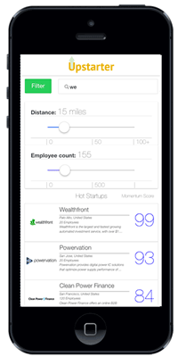

# Upstarter

<p align="center">

</p>

[Upstarter](http://upstarter-client.herokuapp.com) gives job hunters investor-grade insight into the heated startup market, straight from a convenient hybrid mobile app.

Drawing on over 90,000 startups, Upstarter rank orders top companies by a "Momentum Score". Factoring in fundraising history, expenditures and employee count, the Momentum Score is a startup's percentile ranking compared to similar companies.

## How it works

Upon opening Upstarter, you can connect your LinkedIn account to view your connections to startups you lookup.

<p align="center">

</p>

After loading the search page, you will see the top 10 hottest startups, ordered by their Momentum Score percentile.

<p align="center">

</p>

You can search for individual startups from the top searchbar or filter by employee size and distance:

<p align="center">

</p>

Upon finding a startup you are interested in, simply tap it to view more details:

<p align="center">

</p>

If you have linked your LinkedIn account, you will also see your connections within that company:

<p align="center">

</p>

## How to get access

Upstarter is in pre-release alpha testing and will be deployed to iOS and Android stores before the end of February. Demo the app by cloning the repository and running ```ionic serve``` from the 'client' folder.

## Known issues

* Data requests access a remote Heroku server at upstarter-server.herokuapp.com, which may take a few moments to bootup after a period of low request volume. It could also result in slow search.

* Currently not all startups have employee data, leading to a number of startups without Momentum Scores. Alternatives have been identified and will be implemented.


## Technologies
  * **Node + Express.js**: Backend framework
  * **MongoDB + Mongoose**: Database and ORM ([blog post on Mongoose ORM REPL](http://germinar.io/blog/2015/01/29/mongoose-repl-shell-console/)
  * **Geospatial Mongo queries and geolocation**: Developed for radius search
  * **Crunchbase API**: API for information on startups
  * **Background jobs**: Several node background job files manage API calls made to Crunchbase, Momentum Score calculations, and other data tasks
  * **AngularJS**: Front-end framework
  * **Ionic**: Hybrid mobile framework
  * **Heroku**: Deployment
  * **Mocha**: Backend testing
  * **Nock**: API mocks
  * **LinkedIn oAuth**: For connections data
  * **JWT/Passport**: oAuth helpers
  * **Istanbul**: Backend test coverage
  * **Android Store and Apple Store**: Deployment (in progress)
  * **Local storage**: For optimizing frontend experience

Please submit any feedback or suggestions in the issues of this repository. Onwards and upwards!
